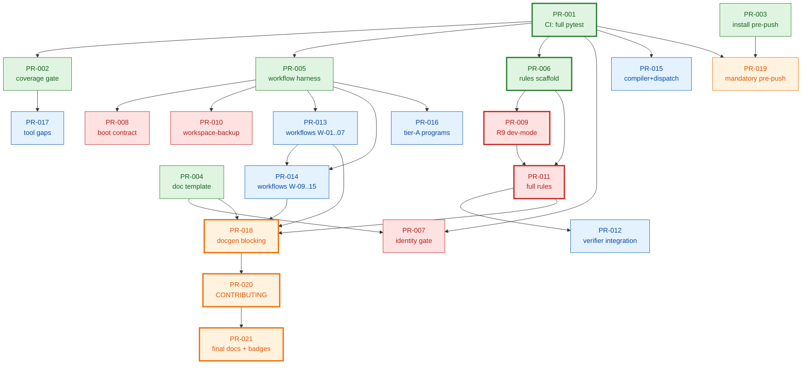

# DAG — AXON Test Battery

> Project: axon-tests · Generated: 2026-05-16
> Source: canonical SQL todo_deps + `02-prs.md`
> 21 nodes · 25 edges · **acyclic** ✓
> Critical path: 7 PRs (PR-001 → PR-006 → PR-009 → PR-011 → PR-018 → PR-020 → PR-021)

## Mermaid graph



## Topological levels (max parallelism per level)

| Level | Can run in parallel                                                | Width |
|-------|--------------------------------------------------------------------|-------|
| L0    | PR-001 · PR-003 · PR-004                                           | 3     |
| L1    | PR-002 · PR-005 · PR-006 · PR-007 · PR-015 · PR-019                | 6     |
| L2    | PR-008 · PR-009 · PR-010 · PR-013 · PR-016 · PR-017                | 6     |
| L3    | PR-011 · PR-014                                                    | 2     |
| L4    | PR-012 · PR-018                                                    | 2     |
| L5    | PR-020                                                             | 1     |
| L6    | PR-021                                                             | 1     |

Max parallel width is 6 (at L1 and L2). With unlimited reviewers,
the project finishes in 7 sequential steps (the critical path).

## Critical path (longest chain)

```
PR-001 ──▶ PR-006 ──▶ PR-009 ──▶ PR-011 ──▶ PR-018 ──▶ PR-020 ──▶ PR-021
( CI )     (scaffold)  ( R9 )    (full     (gate     (CONTRIB)   (docs +
                                  rules)    blocking)             badges)
```

Any delay on these 7 PRs slips the whole project. PR-001 and PR-006
are the two earliest critical nodes — keep them ungrouped and ship
them first.

## Notable fan-out / fan-in

- **Fan-out from PR-005** (workflow harness): 5 children
  (PR-008, 010, 013, 014, 016). If PR-005 slips, half of Wave B/C
  blocks.
- **Fan-out from PR-001** (CI full-suite): 6 children. The single
  highest-leverage node.
- **Fan-in to PR-018** (doc gate blocking): 4 parents
  (PR-004, 011, 013, 014). PR-018 cannot start until every doc-
  producing PR has landed.

## Independent starting nodes (parallel work today)

PR-001, PR-003, PR-004 have no dependencies. They can all be
implemented in parallel right now.

## See also

- `02-plan.md`   — tactical plan
- `02-prs.md`    — PR list (titles, scope, deps)
- `02-roadmap.md` — strategic roadmap (releases R1..R4)
- `DAG.json`     — machine-readable form of this graph
