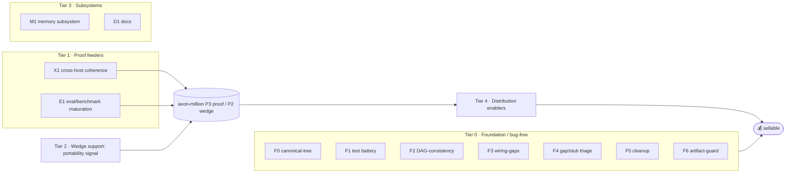

# Masterplan — AXON Improvements (the single consolidated backlog)

> One plan for all internal AXON improvement work. Built 2026-05-27 by consolidating
> 29 scattered projects into `../obsolete/` and 4 finished into `../finished/`.
> This file is the single source of "what's left + in what order." Items are tagged
> `[source-project · last-phase]` so nothing is lost.

## Scope
- **In:** kernel, quality/bug-free gates, tooling, cross-host consistency, memory, docs, distribution enablers.
- **Out (separate top-level projects):** `axon-million` (product/proof — *consumes* Tiers 1 & 2),
  `reservoir-eng` (domain; supplies benchmark goals 1/2), `cpg-to-unstructure` (external), `lab2-*` elifoot.

## The guideline (critical path → million)
```
Tier 0 FOUNDATION (bug-free, parallel/ongoing) ─┐
                                                ├─► 💰 polished · bug-free · sellable
axon-million P3 PROOF (rigorous MCP arm → number) ─► P2 WEDGE (Axiom v1.1) ─► Tier 4 DISTRIBUTE ─┘
        ▲ current front                 feeders: Tier 1 (cross-host, eval) · reservoir-eng (goals 1/2)
```



---

## Tier 0 — Foundation / "bug-free" gates  (gate "sellable"; do first, in parallel)
- **F0 · Converge to ONE canonical axon tree.** Three live trees today
  (`/mnt/c/projects/axon`, `new-axon/axon`, `axon-development/axon`); pillar code only
  in `new-axon/axon`. Decide the canonical repo + retire the rest. *[NEW — biggest sellability risk]*
- **F1 · Test battery → enforce.** `[axon-tests · 5-enforce]` finish the enforcement layer.
- **F2 · DAG-as-truth + auto-emit.** `[dag-consistency · RE-ACTIVATED 2026-05-27 — live top-level project, blocks axon-viz]` (supersedes firing-dag-missing). Phases: 1-gate (R_DAG_CONSISTENT) → 2-cascade (wire 7 mutation programs) → 3-nest (nested project⊃phase⊃PR DAG). Provides the enforced schema `axon-viz`'s full build needs.
- **F3 · Wire unwired memory keys.** `[axon-wiring-gaps · 1-design]` audit read-but-never-written W:/L: keys.
- **F4 · Stub census + gap triage.** `[axon-gap-closure · 1-stub-census]` close worth-closing TODO/XXX/xfail; document the rest.
- **F5 · Testing-error + requirements-bloat cleanup.** `[axon-cleanup · 3-implement]`
- **F6 · Artifact brand-guard kernel gate.** `[axon-artifact-guard · 1-guard]` block Claude/harness
  identity in commits/PRs/files (static lint, works under any harness).

## Tier 1 — Proof feeders  (→ feed axon-million P3 benchmark)
- **E1 · Eval/benchmark maturation.** `[axon-ascent · 3-safety-budget]` phases 4-eval / 5-benchmark;
  seeds + confidence intervals + richer scoring for the dual-agent eval.
- **X1 · Cross-host coherence cluster** → benchmark goal #4 *and* Axiom portability:
  `[axon-claude-code-consistency · 2-design]` · `[axon-copilot-anchor · 2-design]` ·
  `[axon-copilot-consistency · 2-design]` · `[copilot-deviation-study · 1-design]`.
- *(done, referenced)* `R_GROUNDED_CLAIMS` cite-or-abstain gate → benchmark goal #5.

## Tier 2 — Wedge support  (→ feed axon-million P2 Axiom v1.1)
- **W1 · Portability + enforcement-gap signal** from X1, feeding Axiom v1.1
  (cross-host behavior diff + "rules with no mechanical check").

## Tier 3 — Subsystems
- **M1 · Memory subsystem.** `[axon-memory · 2-plan]` native, harness-portable memory + reminders
  (incl. kernel load-wire #96).
- **D1 · Docs.** `[axon-docs · obsolete-meta]` regenerate AXON-DOCS; the doc commit (PR-S01).

## Tier 4 — Distribution enablers
- Onboarding script `[lab2-15]` · prefs-doctor `[lab2-14]` · unified tool-help `[lab2-08]` ·
  real cron-runner `[lab2-07]` · programs INDEX generator `[lab2-13]`. (Product-side packaging/registry lives in axon-million Tier D.)

## Parked — low priority / never-started  (captured so they're not lost)
- `[axon-coherence-v2 · 0-seed]` structural-coherence v2 across program graphs.
- `[axon-ranker-v2 · 0-seed]` closed-loop ranker (cap/floor/decay).
- `[axon-user · 0-init]` user simulation.
- lab2 axon-tooling stubs (study-only): tutorial `[06]`, lint-quiet `[09]`, shadow-boot `[17]`,
  demand-goals `[18]`, lab-meta `[20]`.

---

## Reference

**Finished (`../finished/`):**
`axon-audit-2026` (million-dollar verdict ✓) · `axon-synapse` (orchestration + auto-workflow ✓) ·
`axon-polish` (heavy-workflow readiness ✓) · `axon-autoimprove` (closed — one open item: PR-211, parked).

**Superseded → folded here (`../obsolete/`):** the 29 projects above; open scope migrated into Tiers 0–4.

**Sequencing.** Tier 0 is the bug-free gate and runs continuously. The million spine is
`axon-million P3 (proof) → P2 (wedge) → Tier 4 (distribute)`, fed by Tier 1/2 and reservoir-eng.
Current front: **axon-million P3 — the rigorous MCP arm** (build the real "AXON-over-MCP" operator;
owner pick: conservative arms, cover all goals).
