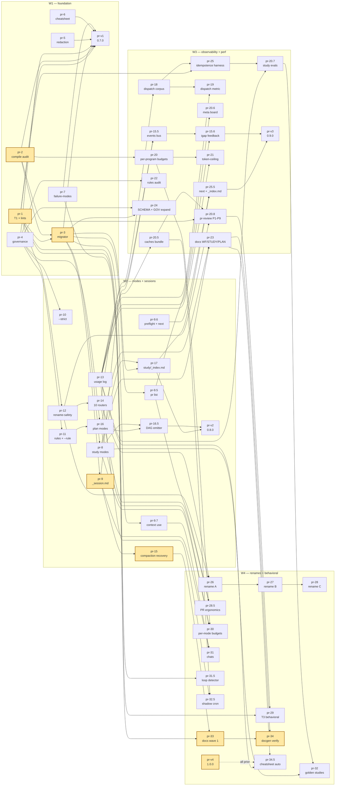

# DAG — axon-master plan v5

**Generated**: 2026-05-16 (manual; will be regenerated by `tools/plan_dag.py` once PR-16.5 ships)
**Source**: `**Depends-on**:` lines in `pr-*.md`
**Acyclicity**: verified (Kahn's algorithm by hand)
**Nodes**: 51 functional + 4 version-bump PRs = 55
**Critical path**: pr-1 → pr-2 → pr-3 → pr-9 → pr-15 → pr-33 → pr-34 → pr-v4 (8 hops)

## Mermaid graph

> Critical-path nodes are highlighted yellow. They form the longest chain (pr-1 → pr-2 → pr-3 → pr-9 → pr-15 → pr-33 → pr-34 → pr-v4). Slip on any of these = slip the project.

## Topological order (by wave)

### W1 (parallel-safe entry: pr-1, pr-2, pr-4, pr-5, pr-6, pr-7)
1. pr-1 _(no deps)_
2. pr-2 _(no deps)_
3. pr-4 _(no deps)_ — parallel with pr-3
4. pr-5 _(no deps)_
5. pr-6 _(no deps)_
6. pr-7 _(no deps)_
7. pr-3 ← pr-1, pr-2
8. pr-v1 ← pr-1..pr-7

### W2
9.  pr-9.6 _(no deps)_
10. pr-13 _(no deps)_
11. pr-8 ← pr-3
12. pr-9 ← pr-3
13. pr-9.5 ← pr-3
14. pr-9.7 ← pr-3
15. pr-10 ← pr-4
16. pr-11 ← pr-4
17. pr-12 ← pr-1
18. pr-14 ← pr-12
19. pr-15 ← pr-9
20. pr-16 ← pr-4, pr-11
21. pr-17 ← pr-3, pr-8
22. pr-16.5 ← pr-16, pr-8
23. pr-v2 ← W2 set

### W3
24. pr-18 ← pr-14
25. pr-19 ← pr-18, pr-13
26. pr-20 ← pr-2
27. pr-15.5 ← pr-9, pr-13
28. pr-15.6 ← pr-13, pr-15.5
29. pr-20.5 ← pr-13
30. pr-20.6 ← pr-9.5
31. pr-21 ← pr-13, pr-20
32. pr-22 ← pr-4
33. pr-23 ← pr-8, pr-16
34. pr-24 ← pr-3, pr-4
35. pr-25 ← pr-1, pr-18
36. pr-20.7 ← pr-13, pr-25
37. pr-20.8 ← pr-2, pr-12, pr-20.5
38. pr-25.5 ← pr-17, pr-9.6
39. pr-v3 ← W3 set

### W4
40. pr-26 ← pr-12, pr-14
41. pr-27 ← pr-26
42. pr-28 ← pr-27
43. pr-28.5 ← pr-14, pr-9.5
44. pr-29 ← pr-1, pr-20.8
45. pr-30 ← pr-8, pr-16, pr-20
46. pr-31 ← pr-9, pr-9.7
47. pr-31.5 ← pr-1
48. pr-32 ← pr-8, pr-20.7
49. pr-32.5 ← pr-13, pr-20.5
50. pr-33 ← pr-15, pr-7
51. pr-34 ← pr-23, pr-33
52. pr-34.5 ← pr-23, pr-13
53. pr-v4 ← all prior

## Leaf entry points (no inbound deps)
- W1: **pr-1, pr-2, pr-4, pr-5, pr-6, pr-7** — six PRs maximally parallel at session start.
- W2: **pr-9.6, pr-13** — startable immediately when W1 gates pass (no W1 dep).

## Convergence points (high fan-in)
- **pr-v4**: every prior PR (intentional — release gate).
- **pr-v3**: 16 W3 PRs.
- **pr-v2**: 14 W2 PRs.
- **pr-30**: 3 deps (pr-8, pr-16, pr-20) — first cross-wave converge.
- **pr-20.8**: 3 deps (pr-2, pr-12, pr-20.5) — critical W3 converge.

## Fan-out bottlenecks (high out-degree)
- **pr-1**: blocks pr-3, pr-12, pr-25, pr-29, pr-31.5, pr-v1 (and through them, much more). Top critical-path source.
- **pr-3**: blocks pr-8, pr-9, pr-9.5, pr-9.7, pr-17, pr-24, pr-v1 — schema is the choke point.
- **pr-13** (usage log): blocks 10+ downstream — observability foundation.

## How to use this DAG
- **Start any leaf** (W1 set). Six PRs maximally parallel at day 1.
- **Critical-path attention**: pr-1 → pr-2 → pr-3 is the longest serial run early; finish them fast.
- **Bottleneck PRs** (pr-1, pr-3, pr-13): treat as MUST; never park.
- **CI/regen**: PR-16.5 (`tools/plan_dag.py`) will keep this file regenerable from `**Depends-on**:` lines.

## Acyclicity check (manual)
Kahn's algorithm by hand:
- Round 1 (in-degree 0): pr-1, pr-2, pr-4, pr-5, pr-6, pr-7, pr-9.6, pr-13 → 8 nodes
- Round 2: pr-3, pr-12, pr-22, pr-20 → 4 nodes
- Continues to drain → 0 nodes left → **acyclic** ✓.

No cycle. Plan is implementable in topological order.
