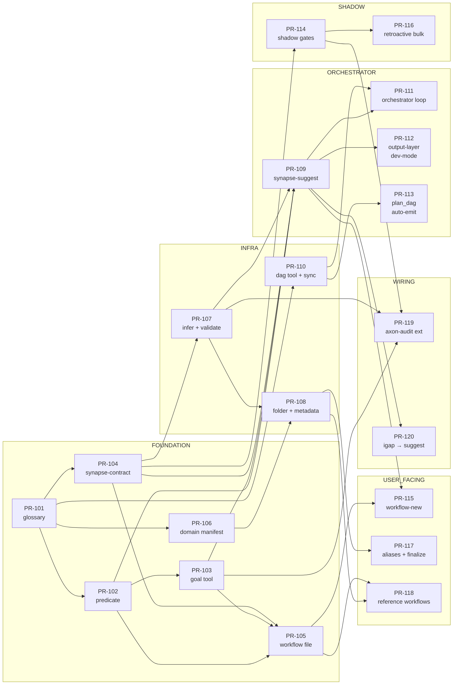

# DAG — axon-synapse / Phase 2 / Plan-level

**Schema**: axon-dag v1
**Level**: plan
**Owner**: axon-synapse/phases/2-design
**Generated**: 2026-05-17T16:30:00Z (manual; normalized lowercase per dag-spec-v1)
**Validated**: true — Python Kahn check 2026-05-17 (lint pass): 20 nodes, 30 edges, 0 cycles
**Critical path** (5 hops, canonical): pr-101 → pr-104 → pr-107 → pr-108 → pr-117
**Equivalent 5-hop paths** (same length, different terminal):
- pr-101 → pr-104 → pr-107 → pr-108 → pr-118
- pr-101 → pr-102 → pr-103 → pr-109 → {pr-111 / pr-112 / pr-115 / pr-120}
- pr-101 → pr-104 → pr-107 → pr-109 → {pr-111 / pr-112 / pr-115 / pr-120}

## Mermaid graph



## Node table

| ID | Kind | Label | Status | Risk |
|----|------|-------|--------|------|
| PR-101 | pr | glossary → docs | pending | low |
| PR-102 | pr | predicate tool | pending | medium |
| PR-103 | pr | goal tool + schema | pending | medium |
| PR-104 | pr | synapse-contract schema | pending | low |
| PR-105 | pr | workflow file schema | pending | low |
| PR-106 | pr | domain manifest + reference manifests | pending | low |
| PR-107 | pr | synapse-infer + synapse-validate | pending | medium-high |
| PR-108 | pr | domain folder + metadata migrate | pending | medium |
| PR-109 | pr | synapse-suggest tool | pending | high |
| PR-110 | pr | DAG spec + dag tool + sync | pending | medium |
| PR-111 | pr | orchestrator loop (program) | pending | high |
| PR-112 | pr | output-layer suggestions [dev-mode] | pending | medium |
| PR-113 | pr | plan_dag auto-emit hook | pending | low |
| PR-114 | pr | shadow enforcement gates | pending | medium |
| PR-115 | pr | workflow-new conversational author | pending | medium |
| PR-116 | pr | shadow retroactive bulk migration | pending | medium |
| PR-117 | pr | aliases + finalize + self-review | pending | medium |
| PR-118 | pr | reference workflows ship | pending | low |
| PR-119 | pr | axon-audit extension | pending | low |
| PR-120 | pr | igap + auto-improve → synapse-suggest | pending | low |

## Critical path (5 hops)

Canonical:
```
pr-101 (glossary)
  → pr-104 (synapse-contract)
  → pr-107 (synapse-infer + validate)
  → pr-108 (domain folder + metadata migrate)
  → pr-117 (aliases + finalize + self-review)
```

Note: pr-101 → pr-104 → pr-107 → pr-108 → pr-118 has the same length.
Several other 5-hop paths exist via pr-109 or pr-103. All have length 5.

Implication: the longest blocking chain is 5 PRs. Everything else can
overlap. **Earlier text claiming 8 hops was incorrect — fixed in lint pass.**

## Parallelization

- **Group 1** (after PR-101): PR-102, PR-104, PR-106, PR-110 — all parallel.
- **Group 2** (after Group 1): PR-103, PR-105, PR-107, PR-113 — parallel.
- **Group 3** (after PR-107 + PR-103 + PR-104): PR-108, PR-109, PR-114 — parallel.
- **Group 4** (after PR-109): PR-111, PR-112, PR-115, PR-120 — parallel.
- **Group 5** (after PR-114 + PR-108): PR-116, PR-117, PR-118 — parallel.
- **Group 6** (final): PR-119.

Critical path determines minimum elapsed time; others can overlap.

## Phase 4 candidates (post-1.0)

| ID | Label | Depends-on |
|----|-------|------------|
| PR-150 | study-dev domain | PR-106, PR-115 |
| PR-151 | cross-domain workflow examples | PR-150 |
| PR-152 | ranker tuning from lived data | PR-109, PR-120 |
| PR-153 | workflow-compile | PR-115 |

## Warnings

- PR-112 requires dev-mode flip; isolate to single PR scope.
- PR-116 touches 119 existing PR specs; dry-run + undo mandatory.
- PR-109 + PR-111 are the highest-risk PRs; allocate review buffer.
