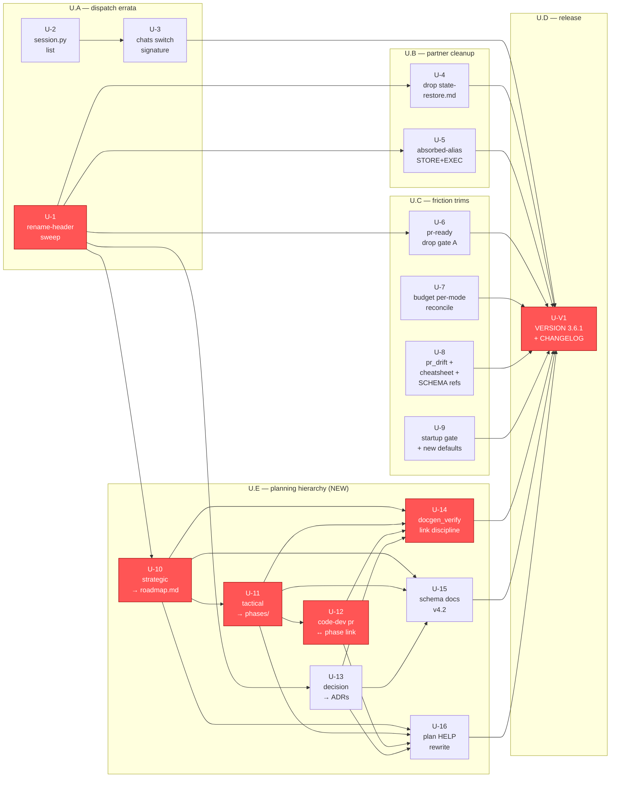

# DAG-v3 — axon-user plan v3 (errata + planning-hierarchy upgrade)

**Generated**: 2026-05-16 · **Schema**: plan-dag-v1
**Nodes**: 17 functional + 1 version-bump = 18
**Critical path**: U-1 → U-10 → U-11 → U-12 → U-14 → U-V1 (6 hops)
**Supersedes**: [`DAG.md`](DAG.md) (v2, 10 nodes)

## Mermaid graph



## Topological order (one valid ordering)

```
U-1                            (root)
U-2  U-7  U-8  U-9             (no deps)
U-4  U-5  U-6  U-10  U-13      (after U-1)
U-3                            (after U-2)
U-11                           (after U-10)
U-12  U-15                     (after U-11)
U-16                           (after U-12)
U-14                           (after U-10,11,12,13)
U-V1                           (after all)
```

## Critical path

`U-1 → U-10 → U-11 → U-12 → U-14 → U-V1` (6 hops).

The critical path goes through the new wave U.E because:
- U-1 is the root for all dispatch-correct PRs.
- U-10..U-14 are the load-bearing chain that *installs* the hierarchy.
- U-V1 cannot ship until U-14's link integrity gate is green.

v2's old critical path (`U-1 → U-3 → U-5 → U-6 → U-V1`) is subsumed —
those PRs remain in the plan but are now parallelizable side-tracks.

## Edge inventory (v3 additions only)

| from | to    | reason                                                      |
|------|-------|-------------------------------------------------------------|
| U-1  | U-10  | strategic-write touches renamed program file                |
| U-1  | U-13  | decision-write same as above                                |
| U-10 | U-11  | phases reference their parent roadmap                       |
| U-11 | U-12  | PR template needs the phase doc as a target                 |
| U-10..U-13 | U-14 | linter cannot validate what doesn't exist               |
| U-10..U-13 | U-15 | docs name templates added by these PRs                  |
| U-10..U-13 | U-16 | HELP describes artifacts produced by these PRs          |
| U-14 | U-V1  | link integrity must be green at release                     |
| U-15 | U-V1  | schema must be sealed at release                            |
| U-16 | U-V1  | user-facing docs must match shipped behavior                |

## Acyclicity verification

Kahn's algorithm by hand:
1. In-deg 0: U-1, U-2, U-7, U-8, U-9 → emit.
2. After U-1 removed: U-4, U-5, U-6, U-10, U-13 → emit.
3. After U-2 removed: U-3 → emit.
4. After U-10 removed: U-11 → emit.
5. After U-11 removed: U-12, U-15 → emit.
6. After U-12 removed: U-16 → emit.
7. After U-13 removed (already): U-14 → emit.
8. After all functional emitted: U-V1 → emit.

No nodes remain. **Acyclic = true**.
