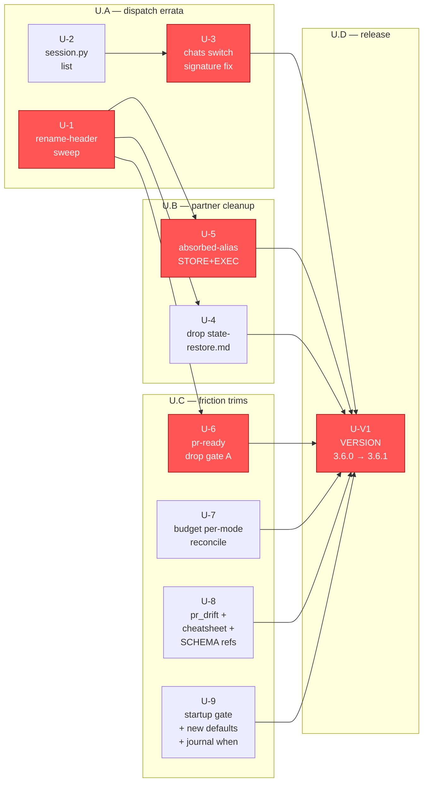

# DAG — axon-user plan v1

**Generated**: 2026-05-16 (manual; would be regenerated by `tools/plan_dag.py` if available)
**Source**: `**Depends-on**:` lines in `u-*.md`
**Acyclicity**: verified (Kahn's algorithm by hand)
**Nodes**: 9 functional + 1 version-bump = 10
**Critical path**: U-1 → U-3 → U-5 → U-6 → U-V1 (5 hops)

## Mermaid graph



## Topological order

```
U-1
U-2
U-3      (after U-2)
U-4      (after U-1)
U-5      (after U-1)
U-6      (after U-1)
U-7
U-8
U-9
U-V1     (after all of the above)
```

## Critical path

`U-1 → U-3 → U-5 → U-6 → U-V1` — 5 hops.

Rationale:
- **U-1** is the single root: every body-dispatch fix depends on it.
- **U-3** depends transitively on U-2 (session.py CLI surface) which itself
  depends on dispatch. It's on the critical path because chats is a
  user-visible W-12 deliverable referenced by U-V1's CHANGELOG.
- **U-5** depends on U-1 (router file must dispatch correctly first).
- **U-6** depends on U-1 (rewiring touches renamed file targets).
- **U-V1** is the convergence point.

## Off-path PRs (parallelizable)

- **U-2** — no upstream after itself; trivially parallel.
- **U-4** — depends only on U-1; subtractive.
- **U-7, U-8, U-9** — each touches an independent surface; can land in any
  order after U-1.

## Edge inventory

| from | to    | reason                                                      |
|------|-------|-------------------------------------------------------------|
| U-1  | U-4   | state-save.md needs correct header before alias-desc edit   |
| U-1  | U-5   | router internals must dispatch before stub STORE+EXEC works |
| U-1  | U-6   | safety-preflight target needs correct header                |
| U-2  | U-3   | program-side fix relies on `session.py list` existing       |
| U-3  | U-V1  | gates U.C exit criterion (chats W-12 deliverable)           |
| U-5  | U-V1  | gates U.B exit                                              |
| U-4  | U-V1  | gates U.B exit                                              |
| U-6  | U-V1  | gates U.C exit                                              |
| U-7  | U-V1  | gates U.C exit                                              |
| U-8  | U-V1  | gates U.C exit                                              |
| U-9  | U-V1  | gates U.C exit                                              |

## Acyclicity verification

Kahn's algorithm by hand:

1. In-degree 0 nodes: U-1, U-2, U-7, U-8, U-9.
2. Emit U-1; decrement in-deg of U-4, U-5, U-6 → 0.
3. Emit U-2; decrement U-3 → 0.
4. Emit U-7, U-8, U-9.
5. Emit U-4, U-5, U-6.
6. Emit U-3.
7. All non-U-V1 nodes emitted; in-deg of U-V1 → 0. Emit U-V1.

No nodes remain; acyclic = true.
